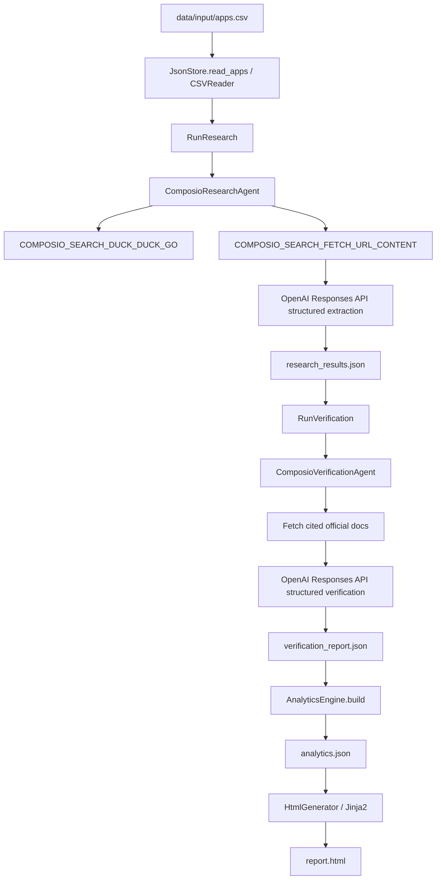

# AI Research Agent for SaaS API Discovery

Principal-engineer handoff for the production Python pipeline that researches
SaaS developer platforms, verifies extracted API metadata against official
documentation, builds aggregate analytics, and publishes a static HTML case
study.

The system is intentionally simple at the center and opinionated at the edges:
domain models define the contract, use cases coordinate the workflow, and
adapters own external integrations with Composio, OpenAI, CSV/JSON storage, and
Jinja2 reporting.

## Executive Summary

This repository implements a single intelligent research pipeline:

```text
apps.csv
  -> Composio Research Agent
  -> Official documentation search and fetch
  -> OpenAI Responses API structured extraction
  -> ResearchResult
  -> Composio Verification Agent
  -> Field-level evidence verification
  -> AnalyticsEngine
  -> HtmlGenerator
  -> report.html
```

The current generated artifact set contains:

| Artifact | Purpose |
| --- | --- |
| `data/output/research_results.json` | Per-app metadata extracted from official documentation. |
| `data/output/verification_report.json` | Independent field-level verification results. |
| `data/output/analytics.json` | Aggregate metrics, breakdowns, insights, and summaries. |
| `data/output/report.html` | Static case-study dashboard rendered from the JSON artifacts. |

The active CLI command is:

```bash
python -m research_agent.cli.main --input data/input/apps.csv --output-dir data/output
```

When installed as a package, the same entrypoint is exposed as:

```bash
research-agent --input data/input/apps.csv --output-dir data/output
```

## Product Question

For each SaaS application in `apps.csv`, the pipeline attempts to answer:

- What product category does this app belong to?
- Does official developer documentation exist?
- What authentication model is documented?
- What API surface exists, such as REST or GraphQL?
- Are official SDKs or client libraries available?
- Is existing MCP support discoverable from official evidence?
- How buildable is an integration?
- What is the primary implementation blocker?
- Which fields can be independently verified from official documentation?

`Unknown` is an intentional output. The agent should return `Unknown` when
official evidence is missing or insufficient. That behavior protects the system
from inventing API capabilities.

## Architecture Principles

1. Domain models are the contract.
   `ResearchResult`, `VerificationResult`, and `Analytics` are the stable
   exchange formats between stages.

2. Use cases orchestrate, but do not know vendors.
   `RunResearch`, `RunVerification`, and `PipelineOrchestrator` coordinate
   stage boundaries without embedding Composio or OpenAI details.

3. Adapters own external behavior.
   Tool calls, LLM calls, CSV/JSON persistence, and HTML rendering live at the
   application edge.

4. Verification is independent.
   The verification agent reopens cited documentation and validates fields
   against fetched source text instead of trusting the research stage.

5. Code selects public-documentation tools deterministically.
   The model receives documentation text. It is not asked to discover Composio
   tools or decide which tool family to use.

6. Static artifacts are first-class.
   Each major stage writes a durable JSON artifact before the next presentation
   layer is generated.

## Clean Architecture Map

```text
config/
  constants.py
  settings.py

data/
  input/apps.csv
  output/

docs/
  architecture.md

src/research_agent/
  domain/
    input_models.py
    research_models.py
    verification_models.py
    analytics_models.py
    enums.py
  interfaces/
    research_agent_port.py
    verification_agent_port.py
    storage_port.py
  use_cases/
    run_research.py
    run_verification.py
    pipeline_orchestrator.py
  analytics/
    engine.py
  adapters/
    agents/
      composio_research_agent.py
      composio_verification_agent.py
    storage/
      csv_reader.py
      json_store.py
    reporting/
      html_generator.py
      templates/
  infrastructure/
    logging_setup.py
    retry_policy.py
    rate_limiter.py
    checkpoint_manager.py
    cache.py
  cli/
    main.py

tests/
  unit/
  integration/
```

The active runtime implementation is under `src/research_agent`. The root-level
`research/` and `verification/` packages are older scaffold modules and are not
composed by `research_agent.cli.main`.

## Runtime Flow



Stages are sequential, but research and verification process apps concurrently
inside their stages using bounded `asyncio.Semaphore` concurrency.

## Main Components

### CLI Composition Root

`src/research_agent/cli/main.py` wires the production runtime:

- `JsonStore`
- `ComposioResearchAgent`
- `ComposioVerificationAgent`
- `AnalyticsEngine`
- `HtmlGenerator`
- `PipelineOrchestrator`

It writes exactly these files to the selected output directory:

```text
research_results.json
verification_report.json
analytics.json
report.html
```

### Pipeline Orchestrator

`PipelineOrchestrator` executes the full workflow:

1. Read CSV input.
2. Run research.
3. Save research JSON.
4. Run verification.
5. Save verification JSON.
6. Build analytics.
7. Save analytics JSON.
8. Render the HTML report.

The orchestrator is deliberately thin. It coordinates stage boundaries and
artifact persistence; it does not contain provider-specific logic.

### Research Agent

`ComposioResearchAgent` is the concrete implementation of
`ResearchAgentPort`.

It uses:

- `COMPOSIO_SEARCH_DUCK_DUCK_GO` for public documentation search.
- `COMPOSIO_SEARCH_FETCH_URL_CONTENT` for documentation fetch.
- `OpenAI.responses.parse(...)` with the `ResearchMetadata` Pydantic schema.

Important behavior:

- Builds a targeted query for official developer documentation.
- Selects URLs using official-host and documentation-path heuristics.
- Fetches documentation text before calling OpenAI.
- Uses structured output rather than manual JSON parsing.
- Normalizes unsupported fields to `Unknown`.
- Computes confidence from known fields and evidence URL count.
- Returns a typed failed `ResearchResult` for per-app failures.

### Verification Agent

`ComposioVerificationAgent` is the concrete implementation of
`VerificationAgentPort`.

It uses:

- Existing research evidence URLs first.
- Deterministic `COMPOSIO_SEARCH_FETCH_URL_CONTENT` calls for cited URLs.
- One fallback public documentation search only if all cited fetches fail.
- `OpenAI.responses.parse(...)` with the `VerificationMetadata` schema.

Verification output includes:

- `field_results`: `PASS`, `FAIL`, or `UNKNOWN` per field.
- `field_confidence`: confidence per field.
- `discrepancies`: reasons for failed or unknown fields.
- `supporting_evidence`: official documentation excerpts.
- `verification_status`: verified, partially verified, unverified, or
  contradicted.

This adapter intentionally does not delegate tool selection to the model. The
model is instructed to verify using already-fetched documentation text.

### Analytics Engine

`AnalyticsEngine` is pure computation over research and verification results.

It produces:

- total app count
- verification status counts
- average research and verification confidence
- category, authentication, API type, SDK, MCP, buildability, and blocker
  breakdowns
- confidence distribution buckets
- self-serve and gated-access counts
- generated insights
- top flagged apps
- app summaries for reporting

### HTML Report

`HtmlGenerator` renders a standalone Jinja2 report using:

- `research_results`
- `verification_results`
- `analytics`

The generated page includes:

- executive summary
- architecture and workflow sections
- dashboard metrics
- eight chart canvases
- searchable research matrix
- expandable app detail cards
- verification summary
- human validation notes
- limitations
- tech stack

The page references Chart.js from a CDN. For offline or air-gapped operation,
vendor Chart.js locally and update `index.html.jinja`.

## Report Page Audit

The current `data/output/report.html` was served locally at:

```text
http://127.0.0.1:8765/report.html
```

Observed browser results:

| Check | Result |
| --- | --- |
| Page title | `AI Research Agent for SaaS API Discovery` |
| H1 | `AI Research Agent for SaaS API Discovery` |
| Main sections | hero, summary, architecture, workflow, dashboard, charts, matrix, apps, patterns, verification, human validation, limitations, stack |
| Research matrix rows | 100 |
| Expandable app cards | 100 |
| Chart canvases | 8 |
| Matrix search | Filtering `Slack` reduced the table to 1 visible row. |
| Theme toggle | Dark mode switched to light mode and button text updated. |
| Desktop horizontal overflow | None detected at a 1265px browser viewport. |
| Browser console errors | None detected during inspection. |

The report is suitable as a static review artifact. It should not be treated as
the source of truth; the JSON artifacts remain the source of truth.

## Data Contracts

### Input CSV

`data/input/apps.csv` is read by `CSVReader`.

Expected columns:

```csv
name,category,homepage_url,notes
```

Only `name` is required. Optional columns become hints on `AppInput`.

### ResearchResult

`ResearchResult` contains:

- `app_name`
- `status`
- `summary`
- `category`
- `documentation_urls`
- `evidence`
- `confidence_score`
- `researched_at`
- `raw_agent_metadata`

### VerificationResult

`VerificationResult` contains:

- `app_name`
- `research_result_ref`
- `verification_status`
- `confidence_score`
- `field_results`
- `field_confidence`
- `discrepancies`
- `supporting_evidence`
- `verified_at`

### Analytics

`Analytics` contains:

- run-level counts
- confidence averages
- breakdown dictionaries
- confidence distribution
- access-pattern counts
- success rates
- insights
- flagged apps
- app summaries
- generation timestamp

## Configuration

Settings are loaded by `config/settings.py` through Pydantic settings and `.env`.

Required for live research:

| Variable | Purpose |
| --- | --- |
| `OPENAI_API_KEY` | OpenAI Responses API extraction and verification. |
| `COMPOSIO_API_KEY` | Composio search and URL fetch tools. |

Common optional settings:

| Variable | Default | Purpose |
| --- | --- | --- |
| `MODEL_NAME` | `gpt-4.1` | OpenAI model for research and verification. |
| `COMPOSIO_USER_ID` | `research-agent` | User/session id passed to Composio tool calls. |
| `MAX_CONCURRENT_REQUESTS` | `5` | Bounded concurrency for research and verification. |
| `REQUESTS_PER_SECOND` | `2` | Global request-rate setting. |
| `MAX_SEARCH_RESULTS` | `5` | Max research documentation URLs to fetch. |
| `MAX_DOC_CHARS` | `6000` | Max research documentation text passed to extraction. |
| `MAX_VERIFICATION_DOC_CHARS_PER_URL` | `6000` | Max verification text per URL. |
| `MAX_VERIFICATION_TOTAL_DOC_CHARS` | `24000` | Max verification prompt documentation text. |
| `MAX_VERIFICATION_FALLBACK_SEARCH_RESULTS` | `3` | Max fallback docs fetched during verification. |
| `OPENAI_MAX_OUTPUT_TOKENS` | `1200` | Verification structured output budget. |
| `LOG_LEVEL` | `INFO` | Application logging level. |
| `OUTPUT_DIR` | `data/output` | Default output directory. |

Example `.env`:

```env
OPENAI_API_KEY=sk-...
COMPOSIO_API_KEY=cmp_...
MODEL_NAME=gpt-4.1
LOG_LEVEL=INFO
MAX_CONCURRENT_REQUESTS=5
```

Do not commit `.env`.

## Installation

Python 3.11 or newer is required.

Windows PowerShell:

```powershell
py -3.11 -m venv .venv
.\.venv\Scripts\Activate.ps1
python -m pip install --upgrade pip
python -m pip install -e ".[dev]"
```

POSIX shell:

```bash
python3.11 -m venv .venv
source .venv/bin/activate
python -m pip install --upgrade pip
python -m pip install -e ".[dev]"
```

You can also install pinned runtime dependencies from `requirements.txt`:

```bash
python -m pip install -r requirements.txt
```

## Running The Pipeline

Run the complete pipeline:

```bash
python -m research_agent.cli.main --input data/input/apps.csv --output-dir data/output
```

Expected outputs:

```text
data/output/research_results.json
data/output/verification_report.json
data/output/analytics.json
data/output/report.html
```

Serve the report locally:

```bash
cd data/output
python -m http.server 8765 --bind 127.0.0.1
```

Open:

```text
http://127.0.0.1:8765/report.html
```

On this Windows workspace, the virtualenv executable can be used directly:

```powershell
C:\ComposeioAI\.venv\Scripts\python.exe -m http.server 8765 --bind 127.0.0.1
```

## Development Commands

Compile a changed module:

```bash
python -m py_compile src/research_agent/adapters/reporting/html_generator.py
```

Run tests:

```bash
pytest
```

Run a quick OpenAI connectivity check:

```bash
python check_models.py
```

## Logging And Observability

`configure_logging(...)` writes logs to stderr and `logs/app.log`.

The pipeline logs major stages:

- reading CSV
- running research
- research completion
- running verification
- verification completion
- analytics generation
- HTML report generation
- pipeline completion

The agents log tool selection, documentation fetches, extraction, retries, and
normalization summaries. This matters because most production failures in this
system are evidence-access or provider-response failures, not orchestration
failures.

## Error Handling Model

The Composio adapters catch ordinary per-app failures and return typed failure
results. This lets the pipeline still produce analytics and HTML output when an
individual app cannot be researched or verified.

Current caveat: `RunResearch` and `RunVerification` use `asyncio.gather`
without `return_exceptions=True`. The current adapters absorb expected per-app
failures, but an unexpected bug escaping an adapter can still fail the batch. If
hard per-app isolation is required, convert escaped exceptions into typed
failed domain results at the use-case layer.

## Testing Status

Current tests cover:

- basic domain model validation
- analytics status counts
- analytics breakdown generation

The integration test is currently a placeholder. Meaningful integration testing
should mock or sandbox:

- Composio search results
- Composio URL fetch output
- OpenAI structured responses
- full CLI artifact generation

## Production Readiness Assessment

Strengths:

- Clean separation between domain, interfaces, use cases, adapters, analytics,
  and CLI wiring.
- Deterministic Composio tool selection for public documentation search/fetch.
- OpenAI Responses API structured outputs instead of manual JSON parsing.
- Independent verification stage with field-level status and confidence.
- Complete artifact pipeline from CSV to JSON to static HTML.
- Browser-verified report page with working search, theme toggle, charts, and
  app-card rendering for the current 100-app artifact set.

Risks and hardening steps:

- Add full CLI integration tests with mocked Composio and OpenAI.
- Vendor Chart.js locally for offline report rendering.
- Implement checkpoint persistence if long runs must resume after interruption.
- Add exception isolation at the use-case layer.
- Add persistent fetch caching keyed by URL to reduce repeated provider cost.
- Add schema/version metadata to generated JSON artifacts.
- Add timing metrics per stage and per app.
- Add report-level accessibility checks for keyboard navigation and contrast.

## Provider Boundary

This project uses:

- Composio SDK for search and fetch tooling.
- OpenAI Python SDK for LLM extraction and verification.
- OpenAI Responses API structured output through `client.responses.parse(...)`.

The provider boundary is narrow by design. Future provider changes should be
isolated to `src/research_agent/adapters/agents/` and configuration. They
should not require changes to domain models, ports, orchestration, analytics,
or reporting contracts.
